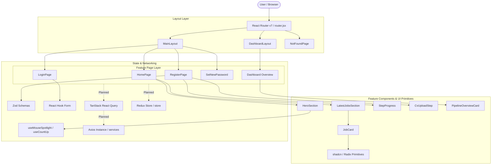
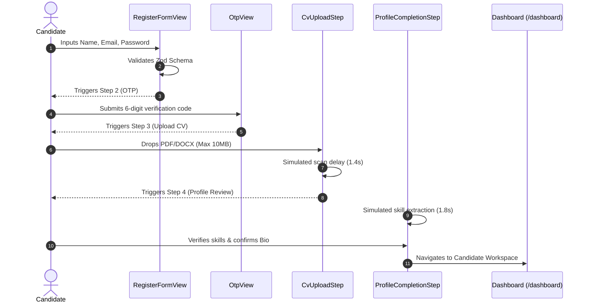

# MatchIn (MatchIn) Frontend — Codebase Architecture & Developer Guide

> **Document Type:** Senior Frontend Architecture Guide & Codebase Audit  
> **Status:** Baseline Documentation (Audited As-Is)  
> **Target Audience:** Any new or existing Software Engineer, Frontend Developer, or Tech Lead working on this repository  
> **Rule of Engagement:** No source files modified or refactored during this audit. This guide reflects the actual, living codebase state, its strengths, conventions, and anti-patterns.

---

## Table of Contents

1. [Executive Summary & Codebase Audit Scope](#1-executive-summary--codebase-audit-scope)
2. [Project Architecture](#2-project-architecture)
3. [Coding Style & Naming Conventions](#3-coding-style--naming-conventions)
4. [React Patterns & Paradigms](#4-react-patterns--paradigms)
5. [API & Axios Architecture](#5-api--axios-architecture)
6. [TanStack Query Architecture](#6-tanstack-query-architecture)
7. [Redux Toolkit Architecture](#7-redux-toolkit-architecture)
8. [Forms & Validation Architecture](#8-forms--validation-architecture)
9. [UI, Design System & Styling Architecture](#9-ui-design-system--styling-architecture)
10. [Routing Architecture](#10-routing-architecture)
11. [Authentication & Authorization System](#11-authentication--authorization-system)
12. [State Management Strategy](#12-state-management-strategy)
13. [Error & Loading Handling](#13-error--loading-handling)
14. [Component Architecture](#14-component-architecture)
15. [Import & Export Conventions](#15-import--export-conventions)
16. [Directory & File Responsibility Matrix](#16-directory--file-responsibility-matrix)
17. [Dependency Analysis](#17-dependency-analysis)
18. [Developer Rules (DOs & DON'Ts)](#18-developer-rules-dos--donts)
19. [New Feature Workflow](#19-new-feature-workflow)
20. [New API Endpoint Workflow](#20-new-api-endpoint-workflow)
21. [New Component Workflow](#21-new-component-workflow)
22. [Current Issues & Potential Improvements (Anti-Patterns Audit)](#22-current-issues--potential-improvements-anti-patterns-audit)
23. [Real Code Examples from the Codebase](#23-real-code-examples-from-the-codebase)
24. [Architecture Diagrams](#24-architecture-diagrams)
25. [Developer Cheat Sheet & Quick Rules](#25-developer-cheat-sheet--quick-rules)

---

## 1. Executive Summary & Codebase Audit Scope

This document is the authoritative architectural and operational documentation for the **MatchIn / MatchIn** frontend client.

### 1.1 Scope of Inspection
- **Total Files in Workspace:** 110 files (99 in `src/`, 11 root configuration/metadata files).
- **Core Technology Stack:**
  - **Runtime & Framework:** React 19 (`19.2.8`), React DOM (`19.2.8`)
  - **Build Tool:** Vite 8 (`8.2.2`) with `@vitejs/plugin-react` (using Oxlint/Oxc)
  - **Routing:** React Router v7 (`react-router-dom: ^7.18.3`) via `createBrowserRouter`
  - **CSS & Design Engine:** Tailwind CSS v4 (`@tailwindcss/vite: ^4.3.3`, `tailwindcss: ^4.3.3`) with `@theme` directive in `src/index.css`
  - **Animation:** Framer Motion (`framer-motion: ^13.2.0`)
  - **Component Primitives:** Radix UI primitives (`@radix-ui/react-slot`, `radix-ui: ^1.6.7`), `class-variance-authority`, `cmdk`, `input-otp`
  - **Forms & Validation:** React Hook Form (`^7.88.0`), Zod (`^4.6.1`), `@hookform/resolvers` (`^5.9.1`)
  - **Server State & Networking:** TanStack React Query v5 (`^5.102.8`), TanStack Query Devtools (`^5.103.1`), Axios (`^1.20.0`)
  - **Client State:** Redux Toolkit (`^2.12.0`), React Redux (`^9.3.0`)
  - **Icons:** `lucide-react` (`^1.42.0`)
  - **Linter:** `oxlint` (`^1.79.0`)

### 1.2 Current Evolution Stage of the Codebase
The application is currently transitioning from an interactive, high-fidelity UI/UX prototype phase toward a production-grade full-stack integrated application:
- **UI & Layouts:** Highly developed, animated with Framer Motion, utilizing customized shadcn/ui primitives and Tailwind CSS v4 tokens.
- **Data Layer:** Primarily driven by rich static mock datasets (`src/constants/`).
- **Server State & Global Store:** Both TanStack React Query and Redux Toolkit are mounted into the root provider tree (`AppProviders`), but neither server queries nor client slices have been implemented yet.
- **API Integration:** Infrastructure exists in dual/split state (see [Section 5](#5-api--axios-architecture)), waiting for endpoints to be connected.

---

## 2. Project Architecture

### 2.1 Architecture Classification: Hybrid Feature-Based Architecture
The project follows a **Hybrid Feature-Based** architecture:
- **Features (`src/features/`):** Business logic, domain pages, feature-specific sub-components, feature-local hooks, and validation schemas are partitioned into feature folders (`Auth`, `HomePage`, `userDashboard`, `NotFoundPage`).
- **Shared Foundation (`src/components/`, `src/lib/`, `src/services/`, `src/constants/`, `src/store/`):** Cross-cutting concerns, UI primitives (shadcn), common layout shells, utility functions, axios instances, and query clients live in centralized shared directories.

### 2.2 Feature vs. Shared Relationship
```text
┌─────────────────────────────────────────────────────────────┐
│                      src/app/router.jsx                     │
└──────────────┬──────────────────────────────┬───────────────┘
               │                              │
      ┌────────▼────────┐            ┌────────▼────────┐
      │   MainLayout    │            │ DashboardLayout │
      └────────┬────────┘            └────────┬────────┘
               │                              │
    ┌──────────┴──────────┐                   │
    │                     │                   │
┌───▼─────────────┐ ┌─────▼──────────┐ ┌──────▼─────────────┐
│    HomePage     │ │   Auth Pages   │ │   userDashboard    │
│  (Hero, Jobs,   │ │ (Login, Reg,   │ │  (Overview, Stats, │
│   Philosophy)   │ │  SetPassword)  │ │   QuickActions)    │
└───┬─────────────┘ └───┬────────────┘ └──────┬─────────────┘
    │                   │                     │
    └───────────────────┼─────────────────────┘
                        │
        ┌───────────────▼───────────────┐
        │       Shared Foundation       │
        │ - components/ui/ (shadcn)     │
        │ - components/shared/          │
        │ - constants/ (mocks)          │
        │ - lib/utils.js (cn)           │
        │ - services/axios & lib/axios  │
        └───────────────────────────────┘
```

### 2.3 Real Directory Tree of the Codebase
The following is the complete, actual file structure inside `src/`:

```text
src/
├── app/
│   ├── App.jsx                                # Root application component
│   ├── providers.jsx                          # Redux Provider + QueryClientProvider wrapper
│   └── router.jsx                             # createBrowserRouter router configuration
├── assets/
│   ├── icons/
│   │   └── google-icon.svg                    # Third-party OAuth vector
│   └── logo/
│       ├── Full_logo.svg
│       ├── Full_logo_light.svg
│       ├── Full_logo_navy.svg
│       └── MatchIn_logo.svg
├── components/
│   ├── layouts/
│   │   └── auth/                              # Note: All layouts are placed here
│   │       ├── AuthLayout.jsx                 # Two-column layout for Auth screens
│   │       ├── MainLayout.jsx                 # Minimal root outlet wrapper
│   │       └── DashboardLayout/
│   │           ├── DashboardFooter.jsx        # Dashboard-specific footer
│   │           ├── DashboardLayout.jsx        # Sidebar + Topbar + Content shell
│   │           ├── Sidebar.jsx                # Collapsible desktop + mobile drawer navigation
│   │           └── Topbar.jsx                 # Global dashboard header with search & profile
│   ├── shared/
│   │   ├── JobCard.jsx                        # Shared job listing card with Framer Motion
│   │   ├── Loader.jsx                         # Circular animated spinner (currently unused)
│   │   ├── Navbar.jsx                         # Minimal navigation bar (currently unused)
│   │   └── auth/
│   │       ├── AuthCard.jsx                   # White container card for auth forms
│   │       └── Authsidepanel .jsx             # Visual side panel with image scrim & branding (note trailing space)
│   └── ui/                                    # 17 shadcn/ui components
│       ├── badge.jsx
│       ├── button.jsx
│       ├── card.jsx
│       ├── checkbox.jsx
│       ├── command.jsx
│       ├── dialog.jsx
│       ├── field.jsx                          # Radix/CVA field system
│       ├── form.jsx                           # React Hook Form + Radix primitive wrapper
│       ├── input-otp.jsx
│       ├── input.jsx
│       ├── label.jsx
│       ├── popover.jsx
│       ├── progress.jsx
│       ├── select.jsx
│       ├── separator.jsx
│       ├── tabs.jsx
│       └── textarea.jsx
├── constants/
│   ├── categories.js                          # Job sectors & lucide icons
│   ├── dashboardQuickActions.js               # Quick navigation pill definitions
│   ├── jobsMock.js                            # Featured job listings with tags & salaries
│   └── pipelineStats.js                       # Candidate dashboard pipeline metric items
├── features/
│   ├── Auth/
│   │   ├── api/
│   │   │   └── auth.api.js                    # Placeholder API import
│   │   ├── LoginPage/
│   │   │   ├── LoginPage.jsx                  # Main Login view
│   │   │   └── components/
│   │   │       ├── LoginFooter.jsx
│   │   │       └── LoginHeading.jsx
│   │   ├── registerPage/
│   │   │   ├── RegisterPage.jsx               # 4-step wizard container
│   │   │   └── components/
│   │   │       ├── CvUploadStep.jsx           # Drag-and-drop CV upload
│   │   │       ├── OtpView.jsx                # 6-digit OTP confirmation with timer
│   │   │       ├── Passwordinput.jsx          # Reusable password visibility toggler
│   │   │       ├── Profilecompletionstep.jsx  # Skills extraction & bio review
│   │   │       ├── Progress.jsx               # Local progress duplicate
│   │   │       ├── RegisterFormView.jsx       # Step 1 account creation form
│   │   │       ├── RegisterStep.jsx           # Coordinator for RegisterForm + OtpView
│   │   │       └── step-progress.jsx          # Step progress indicator
│   │   ├── schema/
│   │   │   ├── auth-schema.js                 # Register & OTP Zod schemas
│   │   │   ├── cv-schema.js                   # File type & size Zod schema
│   │   │   ├── login-schema.js                # Login credentials Zod schema
│   │   │   ├── newPassword-schema.js          # Password reset Zod schema
│   │   │   └── profile-schema.js              # Profile fields Zod schema
│   │   └── setNewPassword/
│   │       ├── components/
│   │       │   ├── PasswordResetForm.jsx
│   │       │   ├── ResetHeader.jsx
│   │       │   ├── ResetStateView.jsx         # Status card (verifying/expired/success)
│   │       │   ├── SavingPassword.jsx
│   │       │   └── SecurityNotice.jsx
│   │       └── pages/
│   │           └── SetNewPassword.jsx         # Multi-state reset flow
│   ├── HomePage/
│   │   ├── HomePage.jsx                       # Public landing page aggregator
│   │   ├── components/
│   │   │   ├── AIMentorCard.jsx
│   │   │   ├── FinalCTASection.jsx
│   │   │   ├── LatestJobsSection.jsx
│   │   │   ├── CategoriesSection/
│   │   │   │   ├── CategoriesSection.jsx
│   │   │   │   └── CategoryCard.jsx
│   │   │   ├── HeroSection/
│   │   │   │   ├── HeroBadge.jsx
│   │   │   │   ├── HeroHeadline.jsx
│   │   │   │   ├── HeroMetrics.jsx
│   │   │   │   ├── HeroPopularSearches.jsx
│   │   │   │   ├── HeroSearchBar.jsx
│   │   │   │   └── HeroSection.jsx
│   │   │   └── PhilosophySection/
│   │   │   │   ├── PhilosophyContent.jsx
│   │   │   │   ├── PhilosophySection.jsx
│   │   │   │   └── PhilosophyVisual.jsx
│   │   │   └── WhyMatchIn/
│   │   │       ├── WhyMatchInContent.jsx
│   │   │       ├── WhyMatchInSection.jsx
│   │   │       └── WhyMatchInVisual.jsx
│   │   └── hooks/
│   │       ├── useCountUp.js                  # Framer motion count-up hook
│   │       └── useMouseSpotlight.js           # Radial mouse tracker hook
│   ├── NotFoundPage/
│   │   └── NotFoundPage.jsx                   # Fallback 404 route component
│   └── userDashboard/
│       └── overview/
│           ├── Overview.jsx                   # Dashboard default view
│           └── components/
│               ├── DashboardBreadcrumb.jsx    # URL path reader breadcrumb
│               ├── PipelineOverviewCard.jsx   # Candidate metrics container
│               ├── PipelineStatCard.jsx       # Individual stat metric card
│               └── UserDashboardHeader.jsx    # Greeting & quick action buttons
├── lib/
│   ├── axios.js                               # Axios instance with 401 interceptor
│   ├── i18n.js                                # i18n setup (contains missing dependencies)
│   ├── queryClient.js                         # TanStack Query Client instance
│   └── utils.js                               # cn helper (clsx + tailwind-merge)
├── services/
│   └── axios/
│       ├── axiosInstance.js                   # Secondary Axios instance
│       └── interceptors.js                    # Unconnected request interceptor
├── store/
│   └── index.js                               # Redux Toolkit store (empty reducer)
├── index.css                                  # Tailwind v4 theme definitions
└── main.jsx                                   # React entry point
```

---

## 3. Coding Style & Naming Conventions

### 3.1 Naming Summary Table

| Category | Convention | Examples from Codebase | Inconsistencies / Observations |
| :--- | :--- | :--- | :--- |
| **Component Files** | PascalCase `.jsx` | `LoginPage.jsx`, `JobCard.jsx`, `HeroSection.jsx` | `step-progress.jsx` (kebab-case), `Authsidepanel .jsx` (trailing space before extension) |
| **Component Names** | PascalCase | `function LoginPage()`, `function JobCard()` | `function Demo()` exported as default from `step-progress.jsx` |
| **Feature Folders** | Mixed | `features/Auth/`, `features/HomePage/`, `features/NotFoundPage/` | `features/userDashboard/` (camelCase) |
| **Sub-Feature Folders** | Mixed | `LoginPage/`, `HeroSection/`, `CategoriesSection/` | `registerPage/`, `setNewPassword/`, `overview/` |
| **Helper / Utility Files** | camelCase `.js` | `utils.js`, `queryClient.js`, `axiosInstance.js` | `auth.api.js` (dot notation) |
| **Schema Files** | kebab-case / mixed `.js` | `auth-schema.js`, `cv-schema.js`, `login-schema.js` | `newPassword-schema.js` (mixed camelCase and kebab-case) |
| **Custom Hooks** | camelCase starting with `use` | `useCountUp.js`, `useMouseSpotlight.js`, `useFormField` | Hooks are located inside feature folders, not in a top-level `src/hooks/` |
| **Variables & Functions** | camelCase | `handleRegisterSubmit`, `firstErrorField`, `formatTimer` | Typo in `LoginPage.jsx`: `e.preventDefult()` |
| **Constants** | UPPER_SNAKE_CASE | `JOB_CATEGORIES`, `PIPELINE_STATS`, `RESEND_SECONDS` | In `Profilecompletionstep.jsx`: `MOCK_ANALYSIS` (constant object) |
| **CSS Classes** | kebab-case | `flex`, `min-h-screen`, `bg-background`, `text-primary` | In-line arbitrary Tailwind brackets: `text-[13px]`, `px-8.75`, `rounded-br-[220px]` |

### 3.2 Detailed File Naming Analysis
The codebase currently contains three conflicting folder-naming styles in `src/features/`:
1. **PascalCase:** `features/HomePage/`, `features/NotFoundPage/`, `features/Auth/LoginPage/`
2. **camelCase:** `features/userDashboard/`, `features/Auth/registerPage/`, `features/Auth/setNewPassword/`
3. **kebab-case:** `step-progress.jsx`, `auth-schema.js`, `login-schema.js`

> **Convention Standard to Follow for New Code:**  
> - **Directories:** camelCase (e.g., `features/auth/`, `features/jobs/`, `features/userDashboard/`) or PascalCase if representing a Page directory (`features/auth/loginPage/`). Maintain consistency within your feature.
> - **React Components:** PascalCase with `.jsx` extension (`JobDetailsCard.jsx`).
> - **Pure Functions / Modules:** camelCase with `.js` extension (`jobs.api.js`, `useJobFilter.js`).
> - **Validation Schemas:** kebab-case ending with `-schema.js` (`job-filter-schema.js`).

---

## 4. React Patterns & Paradigms

### 4.1 Functional Components with Explicit Named or Default Exports
All components are React 19 functional components.
- **Pages and Layouts:** Exported as `default` functions:
  ```jsx
  export default function LoginPage() { ... }
  ```
- **UI Primitives and Wizard Steps:** Exported as named functions or forwardRef objects:
  ```jsx
  export function RegisterStep({ onComplete, onPhaseChange }) { ... }
  export const PasswordInput = forwardRef(function PasswordInput(props, ref) { ... });
  ```

### 4.2 Multi-Step Wizard Pattern (Local State Orchestration)
In `features/Auth/registerPage/RegisterPage.jsx`, a 4-step wizard pattern is used where the parent page holds current step index and accumulated step data:
- `step === 0 || step === 1`: Register credentials & OTP verification (`RegisterStep`)
- `step === 2`: CV Upload (`CvUploadStep`)
- `step === 3`: Profile Review & Auto-fill (`ProfileCompletionStep`)

```jsx
// Pattern used in RegisterPage.jsx
const [step, setStep] = useState(0);
const [registerData, setRegisterData] = useState(null);
const [cvFile, setCvFile] = useState(null);

const handleAccountComplete = (data) => {
  setRegisterData(data);
  setStep(2);
};
```

### 4.3 Sequential Error Display Pattern (`SequentialFormMessage`)
A distinctive UX pattern repeatedly found in this codebase (`LoginPage.jsx`, `RegisterFormView.jsx`, `PasswordResetForm.jsx`) is **one-at-a-time form error display**. Instead of showing all validation errors at once, fields are ordered in `FIELD_ORDER`, and only the first active error is rendered with Framer Motion:

```jsx
const FIELD_ORDER = ["email", "password"];

function SequentialFormMessage({ name }) {
  const { errors } = form.formState;
  const firstErrorField = FIELD_ORDER.find((fName) => errors[fName]);
  const isActive = firstErrorField === name;

  return (
    <AnimatePresence mode="wait">
      {isActive && errors[name] && (
        <motion.div
          key={name}
          initial={{ opacity: 0, y: -4, height: 0 }}
          animate={{ opacity: 1, y: 0, height: "auto" }}
          exit={{ opacity: 0, y: -4, height: 0 }}
          transition={{ duration: 0.18, ease: "easeOut" }}
        >
          <FormMessage className="text-[11px] text-error" />
        </motion.div>
      )}
    </AnimatePresence>
  );
}
```

### 4.4 Component Composition & Slotted Layouts
Complex layouts are designed using slot props rather than large nested trees:
- In `AuthLayout.jsx`, the layout accepts modular slots:
  ```jsx
  export default function AuthLayout({
    sidePanel,      // Object passed to <AuthSidePanel {...sidePanel} />
    topRight,       // Top-right action or link
    aboveCard,      // Alerts or headings above the card
    footer,         // Disclaimers or sign-in link
    additional,     // E.g. <StepProgress />
    cardClassName,
    children,       // The form itself inside <AuthCard />
  })
  ```

### 4.5 Scroll-Triggered and Mouse-Tracking Animations
- **In-view animations:** Cards use `viewport={{ once: true, amount: 0.2 }}` with Framer Motion `motion.div`.
- **Count-Up Hook (`useCountUp`):** Combines `useInView` and `animate` from `framer-motion` to smoothly increment numbers from 0 to target when scrolled into view.
- **Radial Spotlight Hook (`useMouseSpotlight`):** Updates CSS variables `--mouse-x` and `--mouse-y` on container mouse movement for dynamic gradient highlights.

---

## 5. API & Axios Architecture

### 5.1 The Dual-Axios Architecture Issue
A critical audit finding is that the project currently possesses **two competing, fragmented Axios configurations**:

```text
               CONFIGURATION A                              CONFIGURATION B
            (src/lib/axios.js)                     (src/services/axios/)
       ┌───────────────────────────┐           ┌────────────────────────────┐
       │        apiClient          │           │            api             │
       ├───────────────────────────┤           ├────────────────────────────┤
       │ Env: VITE_API_BASE_URL    │           │ Env: VITE_API_URL          │
       │ Default: localhost:3000   │           │ Default: undefined         │
       │ Timeout: 15,000ms         │           │ Timeout: 10,000ms          │
       │ Request Token Interceptor │           │ Request Token Interceptor  │
       │ Response 401 Interceptor  │           │ (in separate file)         │
       └─────────────┬─────────────┘           └──────────────┬─────────────┘
                     │                                        │
           USED BY: ZERO FILES                      USED BY: auth.api.js ONLY
```

#### Detailed Comparison:
1. **`src/lib/axios.js`:**
   - Creates `apiClient`.
   - Reads `import.meta.env.VITE_API_BASE_URL || "http://localhost:3000/api"`.
   - Timeout: `15000ms`.
   - **Interceptors:** Attached inline directly to `apiClient`. Injects `Authorization: Bearer ${token}` from `localStorage`. Has response interceptor removing token on HTTP 401.
   - **Status:** **Dormant / Unused.** Not imported anywhere in the project.
2. **`src/services/axios/axiosInstance.js` & `interceptors.js`:**
   - Creates `api`.
   - Reads `import.meta.env.VITE_API_URL` (matches `.env` line `VITE_API_URL=https://skillmatch.iptvdemo.serv5group.com`).
   - Timeout: `10000ms`.
   - Request interceptor is placed in `src/services/axios/interceptors.js`.
   - **Status:** `src/features/Auth/api/auth.api.js` imports `api` from `axiosInstance.js`. **However, `interceptors.js` is NEVER imported anywhere**, meaning the token interceptor in `services/` never executes!

### 5.2 API Layer Status: `src/features/Auth/api/auth.api.js`
The only API file in the codebase is `src/features/Auth/api/auth.api.js`, which currently contains a single unused import:
```javascript
import { api } from "@/services/axios/axiosInstance"
```
No actual HTTP request functions (`api.post`, `api.get`) are written yet.

### 5.3 Required Standard for New API Functions
When implementing backend endpoints, developers must unify around the following contract:
```javascript
// Example of canonical API function standard:
import { api } from "@/services/axios/axiosInstance";

export const authApi = {
  login: async (credentials) => {
    const response = await api.post("/auth/login", credentials);
    return response.data;
  },
  register: async (payload) => {
    const response = await api.post("/auth/register", payload);
    return response.data;
  },
  verifyOtp: async ({ email, code }) => {
    const response = await api.post("/auth/verify-otp", { email, code });
    return response.data;
  },
};
```

---

## 6. TanStack Query Architecture

### 6.1 QueryClient Configuration
TanStack React Query v5 is initialized in `src/lib/queryClient.js` and wrapped in `src/app/providers.jsx`:

```javascript
// src/lib/queryClient.js
import { QueryClient } from "@tanstack/react-query"

export const queryClient = new QueryClient({
  defaultOptions: {
    queries: {
      staleTime: 5 * 60 * 1000,    // 5 minutes
      gcTime: 10 * 60 * 1000,       // 10 minutes garbage collection
      retry: 1,                    // 1 automatic retry on failure
      refetchOnWindowFocus: false, // Prevents aggressive background refetching
      refetchOnMount: false,
      refetchOnReconnect: false,
    },
  },
})
```

### 6.2 Provider Setup & DevTools
In `src/app/providers.jsx`:
```jsx
<Provider store={store}>
  <QueryClientProvider client={queryClient}>
    {children}
    <ReactQueryDevtools />
  </QueryClientProvider>
</Provider>
```
`ReactQueryDevtools` is enabled by default in the application provider tree.

### 6.3 Current Usage vs Target Query Pattern
- **Current State:** There are **zero** `useQuery` or `useMutation` hooks currently used in `src/features/`. All data is currently loaded synchronously from `src/constants/` (e.g. `JOBS`, `CATEGORIES`, `PIPELINE_STATS`).
- **Target Convention:** For any asynchronous server fetching or mutations, developers must create a dedicated `queries.js` or `use[Feature]Query.js` file inside the feature folder:

```javascript
// Target Pattern for Feature Queries:
import { useQuery, useMutation, useQueryClient } from "@tanstack/react-query";
import { jobsApi } from "../api/jobs.api";

// Query Keys Constant
export const jobKeys = {
  all: ["jobs"],
  lists: () => [...jobKeys.all, "list"],
  list: (filters) => [...jobKeys.lists(), filters],
  details: () => [...jobKeys.all, "detail"],
  detail: (id) => [...jobKeys.details(), id],
};

// Query Hook
export function useJobs(filters) {
  return useQuery({
    queryKey: jobKeys.list(filters),
    queryFn: () => jobsApi.getJobs(filters),
  });
}

// Mutation Hook
export function useApplyJob() {
  const queryClient = useQueryClient();
  return useMutation({
    mutationFn: (applicationData) => jobsApi.apply(applicationData),
    onSuccess: () => {
      queryClient.invalidateQueries({ queryKey: jobKeys.lists() });
    },
  });
}
```

---

## 7. Redux Toolkit Architecture

### 7.1 Store Configuration
The Redux Toolkit store is configured in `src/store/index.js`:
```javascript
import { configureStore } from "@reduxjs/toolkit"

export const store = configureStore({
  reducer: {
    
  },
})
```
It is bound to the React tree via `<Provider store={store}>` in `src/app/providers.jsx`.

### 7.2 Current Redux State
- **Slices Count:** 0
- **Reducers Count:** 0
- **Selectors / Dispatches:** None in use.
- **Why?** The application has not yet needed global client-side state. Routing state is in React Router, modal/wizard state is in local component `useState`, and form state is in React Hook Form.

### 7.3 Rule of Separation: Redux vs. TanStack Query
To maintain codebase hygiene, every developer must strictly respect this boundary:

```text
┌─────────────────────────────────────────────────────────────┐
│                    WHAT GOES INTO REDUX?                    │
│  - Global authenticated user session info                   │
│  - Client UI preferences (e.g. sidebar collapsed state,     │
│    theme mode, global notification badges)                  │
│  - Multi-step cross-route wizard drafts that cannot live    │
│    in a single page's useState                              │
└─────────────────────────────────────────────────────────────┘
                               ▲
                         DO NOT MIX
                               ▼
┌─────────────────────────────────────────────────────────────┐
│                WHAT GOES INTO TANSTACK QUERY?               │
│  - Any data coming from the backend REST API                │
│  - Jobs list, category counts, profile details              │
│  - Application pipeline records                             │
│  - Server mutation loading & error states                   │
└─────────────────────────────────────────────────────────────┘
```

### 7.4 Standard for Creating a New Slice
When client global state is required, add a slice in `src/store/slices/[name]Slice.js` and register it in `src/store/index.js`:

```javascript
// src/store/slices/authSlice.js
import { createSlice } from "@reduxjs/toolkit";

const initialState = {
  user: null,
  isAuthenticated: Boolean(localStorage.getItem("token")),
};

export const authSlice = createSlice({
  name: "auth",
  initialState,
  reducers: {
    setCredentials: (state, action) => {
      state.user = action.payload.user;
      state.isAuthenticated = true;
    },
    logoutUser: (state) => {
      state.user = null;
      state.isAuthenticated = false;
      localStorage.removeItem("token");
    },
  },
});

export const { setCredentials, logoutUser } = authSlice.actions;
export const selectCurrentUser = (state) => state.auth.user;
export default authSlice.reducer;
```

---

## 8. Forms & Validation Architecture

### 8.1 Libraries & Core Integration
Forms are built exclusively with:
1. **React Hook Form (`useForm`):** Uncontrolled inputs managed via ref or Controlled via `FormField` (`Controller`).
2. **Zod:** Strict runtime schema definitions.
3. **`@hookform/resolvers/zod` (`zodResolver`):** Schema-to-form bridge.
4. **Custom shadcn UI Form primitives (`src/components/ui/form.jsx`):** `Form`, `FormField`, `FormItem`, `FormLabel`, `FormControl`, `FormMessage`.

### 8.2 Schema Conventions
All schemas are defined in `src/features/Auth/schema/`:
- `auth-schema.js`: Exports `registerSchema` (with `.refine()` matching `password === confirmPassword` and regex checks) and `otpSchema` (6-digit regex).
- `login-schema.js`: Exports `loginSchema` (email format, 8-character password).
- `cv-schema.js`: Validates `instanceof(File)` against `ACCEPTED_TYPES` (`PDF`, `DOC`, `DOCX`) and size limit (10MB).
- `profile-schema.js`: Validates `jobTitle`, `location`, `experience`, `bio`.
- `newPassword-schema.js`: Validates password strength and password confirmation matching.

### 8.3 Form Construction Patterns in the Codebase
There are two patterns currently in use:

#### Pattern A: Controlled shadcn `FormField` (Primary Pattern)
Used in `RegisterFormView.jsx`, `Profilecompletionstep.jsx`, and `PasswordResetForm.jsx`:
```jsx
<Form {...form}>
  <form onSubmit={form.handleSubmit(onSubmit)} className="space-y-4">
    <FormField
      control={form.control}
      name="fullName"
      render={({ field }) => (
        <FormItem>
          <FormLabel>Full Name</FormLabel>
          <FormControl>
            <Input placeholder="Jane Doe" {...field} />
          </FormControl>
          <FormMessage />
        </FormItem>
      )}
    />
    <Button type="submit">Submit</Button>
  </form>
</Form>
```

#### Pattern B: Hybrid Field + Form (Used in `LoginPage.jsx`)
`LoginPage.jsx` mixes `components/ui/field.jsx` (`FieldGroup`, `Field`, `FieldSeparator`) with `components/ui/form.jsx` (`FormField`, `FormItem`, `FormControl`).  
*Note:* For future forms, use **Pattern A** (`components/ui/form.jsx`) exclusively to avoid layout fighting.

---

## 9. UI, Design System & Styling Architecture

### 9.1 Tailwind CSS v4 & `@theme` Configuration
The application runs **Tailwind CSS v4** via `@tailwindcss/vite`. It does not use a legacy `tailwind.config.js`. Instead, design tokens are defined in `src/index.css` via the `@theme` block:

```css
@import "tailwindcss";
@import "tw-animate-css";

@custom-variant dark (&:is(.dark *));

@theme {
  /* MatchIn Theme Palette */
  --color-primary: #1f365c;       /* Midnight Blue */
  --color-secondary: #d06b4f;     /* Terracotta */
  --color-accent: #d4a72c;        /* Golden Mustard */
  --color-background: #faf8f4;    /* Warm Cream */
  --color-surface: #ffffff;       /* Pure White */
  --color-ink: #222831;           /* Main Text / Charcoal */
  --color-muted: #707780;         /* Muted Text / Slate */
  --color-border: #e5e1da;        /* Warm Gray Border */
  --color-success: #4f7a5a;       /* Forest Green */
  --color-warning: #c88a26;       /* Amber */
  --color-error: #b85450;         /* Muted Red */

  --color-primary-foreground: #ffffff;
  --color-secondary-foreground: #ffffff;
  --color-accent-foreground: #222831;
  --color-success-foreground: #ffffff;
  --color-warning-foreground: #ffffff;
  --color-error-foreground: #ffffff;
}
```

### 9.2 The `cn` ClassName Utility & Inconsistency
- **Canonical Utility:** `src/lib/utils.js` exports:
  ```javascript
  import { clsx } from "clsx"
  import { twMerge } from "tailwind-merge"

  export function cn(...inputs) {
    return twMerge(clsx(inputs))
  }
  ```
- **The Inconsistency:** Every component inside `src/components/ui/*.jsx` imports `import { cn } from "cn"`, resolving to an external npm package rather than `@/lib/utils`. In contrast, all layout and feature files import `import { cn } from "@/lib/utils"`.  
  *Rule:* When creating or modifying components, always import `cn` from `@/lib/utils`.

### 9.3 Custom Component Variants via `cva`
`class-variance-authority` (`cva`) is used to manage variant classes in UI primitives (e.g. `buttonVariants` in `src/components/ui/button.jsx` and `badgeVariants` in `src/components/ui/badge.jsx`).

### 9.4 Lucide Icons
Icons are imported directly from `lucide-react`. They are frequently passed as component references into configuration objects:
```javascript
import { Terminal, Palette, Send } from "lucide-react";
const ACTIONS = [{ label: "Sent", icon: Send }];
```

---

## 10. Routing Architecture

### 10.1 Router Engine
The routing layer is implemented in `src/app/router.jsx` using React Router v7's `createBrowserRouter` and mounted using `<RouterProvider router={router} />` inside `src/app/App.jsx`.

### 10.2 Existing Route Inventory

| Route Path | Layout | Feature / Page Component | Purpose / Description | Status / Protection |
| :--- | :--- | :--- | :--- | :--- |
| `/` | `MainLayout` | `HomePage` (`src/features/HomePage/HomePage.jsx`) | Landing page: Hero, Job cards, Mentor teaser, Categories, CTA | Public / Guest |
| `/auth/login` | `MainLayout` → `AuthLayout` | `LoginPage` (`src/features/Auth/LoginPage/LoginPage.jsx`) | User login with email/password and Google OAuth teaser | Public / Guest |
| `/auth/register` | `MainLayout` → `AuthLayout` | `RegisterPage` (`src/features/Auth/registerPage/RegisterPage.jsx`) | 4-step wizard: Credentials → OTP → CV Upload → Profile | Public / Guest |
| `/auth/set-new-password` | `MainLayout` (internal layout) | `SetNewPassword` (`src/features/Auth/setNewPassword/pages/SetNewPassword.jsx`) | Password reset link validation and new password entry | Public / Guest |
| `/dashboard` | `DashboardLayout` | `Overview` (`src/features/userDashboard/overview/Overview.jsx`) | Candidate workspace: greetings, quick actions, application pipeline stats | Private / Unprotected (No Guard yet) |
| `*` | None | `NotFoundPage` (`src/features/NotFoundPage/NotFoundPage.jsx`) | Catch-all 404 page for unmatched routes | Public |

### 10.3 Dead / Broken Links in UI
The following routes are linked in UI components but **not yet defined** in `src/app/router.jsx`:
- `/jobs` (Linked in `Navbar.jsx`, `FinalCTASection.jsx`, `RegisterPage.jsx`, `UserDashboardHeader.jsx`)
- `/auth/forgot-password` (Linked in `LoginPage.jsx`)
- `/mentor` (Linked in `AIMentorCard.jsx`, `UserDashboardHeader.jsx`)
- `/applications` (Linked in `UserDashboardHeader.jsx`)
- `/saved-jobs` (Linked in `UserDashboardHeader.jsx`)
- `/roadmap` (Linked in `UserDashboardHeader.jsx`)
- `/upload-cv` (Linked in `FinalCTASection.jsx`)

Navigating to any of the above paths currently falls through to the 404 `NotFoundPage`.

---

## 11. Authentication & Authorization System

### 11.1 End-to-End Registration Flow (As Implemented)
```text
[Step 0: RegisterFormView]
   │ Validate fullName, email, password, confirmPassword, terms via registerSchema
   ▼
[Step 1: OtpView]
   │ Triggers 30s resend timer
   │ User inputs 6-digit numeric code validated via otpSchema
   ▼
[Step 2: CvUploadStep]
   │ Drag-and-drop or file select (.pdf, .doc, .docx <= 10MB) via cvFileSchema
   │ Simulated 1400ms scan delay
   │ "Browse Jobs" button can skip to /jobs
   ▼
[Step 3: ProfileCompletionStep]
   │ Simulated 1800ms "Reading your CV" model extraction
   │ Pre-fills jobTitle, location, experience, bio via profileSchema
   │ User edits or verifies matched skills
   ▼
[navigate("/dashboard")]
```

### 11.2 End-to-End Login Flow (As Implemented)
1. User enters `email` and `password`.
2. Form is validated against `loginSchema`.
3. Submit currently runs `handleLogin(e) { e.preventDefult(); }` (contains typo and no network dispatch).
4. **Target Flow:** Dispatch login mutation via Axios, store JWT `token` in `localStorage.setItem("token", data.token)`, update Redux `authSlice`, and navigate to `/dashboard`.

### 11.3 Protected Route Implementation
Currently, `/dashboard` is **unprotected**. Any unauthenticated browser can visit `/dashboard`.
When ready, implement a route guard component:

```jsx
// Target Protected Route Component:
import { Navigate, Outlet } from "react-router-dom";

export function ProtectedRoute() {
  const token = localStorage.getItem("token");
  if (!token) {
    return <Navigate to="/auth/login" replace />;
  }
  return <Outlet />;
}
```

---

## 12. State Management Strategy

### 12.1 State Categorization Matrix

```text
┌─────────────────────────┬───────────────────────────────┬───────────────────────────────┐
│ State Type              │ Tool / Mechanism              │ Codebase Examples             │
├─────────────────────────┼───────────────────────────────┼───────────────────────────────┤
│ Server Cache            │ TanStack React Query          │ Jobs, categories, pipeline    │
│ Global Client State     │ Redux Toolkit                 │ Active auth token, user info  │
│ Form State              │ React Hook Form               │ Credentials, OTP, profile bio │
│ Component Local State   │ React.useState                │ Wizard step, password toggle, │
│                         │                               │ collapse sidebar state        │
│ URL / Navigation State  │ React Router (useLocation)    │ DashboardBreadcrumb           │
│ Transient UI Feedback   │ Framer Motion                 │ SequentialFormMessage error   │
└─────────────────────────┴───────────────────────────────┴───────────────────────────────┘
```

---

## 13. Error & Loading Handling

### 13.1 Form Validation Errors
- Evaluated via Zod schemas.
- Displayed using the `SequentialFormMessage` pattern: single active error displayed with `framer-motion` sliding down under the specific invalid field.

### 13.2 Loading States
- **Spinners:** Lucide's `Loader2` with `animate-spin` is the actual pattern used across the app (e.g. in `CvUploadStep.jsx`, `Profilecompletionstep.jsx`, `SavingPassword.jsx`).
- **Simulated Delays:** `setTimeout` calls are currently used to simulate server processing (e.g. 1.4s CV upload, 1.8s CV skill extraction).
- **Global Loader:** `src/components/shared/Loader.jsx` exists but is currently orphaned.

### 13.3 Empty & Status Views
- In `src/features/Auth/setNewPassword/components/ResetStateView.jsx`, a generic state feedback card is used to display multi-condition feedback:
  - `verifying`: Sky blue spinner
  - `expired`: Red clock alert
  - `completed`: Green checkmark with onboarding confirmation
  - `error`: Red triangle alert with "Try Again" action

---

## 14. Component Architecture

### 14.1 Component Sizing & Composition
- **Page Components:** Minimal aggregators (e.g. `HomePage.jsx` is only 20 lines, simply composing `<HeroSection />`, `<LatestJobsSection />`, etc.).
- **Section Components:** Handle section-level state and layout (e.g. `LatestJobsSection.jsx` manages `category` state and filters jobs).
- **Atomic Presentation Components:** Pure UI cards receiving props (e.g. `JobCard.jsx`, `CategoryCard.jsx`, `PipelineStatCard.jsx`).

### 14.2 Placement Rules
```text
Is this component reused across 2+ unrelated features?
   ├── YES: Place in src/components/shared/ (or src/components/ui/ if generic primitive)
   └── NO:  Does it belong to a specific feature?
              └── YES: Place in src/features/[FeatureName]/components/
```

---

## 15. Import & Export Conventions

### 15.1 Path Aliases
The project defines a single path alias `@/` pointing to `src/`:
- Configured in `vite.config.js`:
  ```javascript
  resolve: {
    alias: {
      '@': path.resolve(import.meta.dirname, './src'),
    },
  }
  ```
- Configured in `jsconfig.json`:
  ```json
  "paths": {
    "@/*": ["./src/*"]
  }
  ```

### 15.2 Import Order Convention
Follow this standard order in all files:
1. Third-party React & library imports (`react`, `react-router-dom`, `framer-motion`)
2. Lucide icons (`lucide-react`)
3. UI components (`@/components/ui/...`)
4. Shared components & layouts (`@/components/shared/...`, `@/components/layouts/...`)
5. Feature-local components & hooks (`./components/...`, `../hooks/...`)
6. Utilities, constants, schemas (`@/lib/utils`, `@/constants/...`, `@/features/.../schema/...`)

---

## 16. Directory & File Responsibility Matrix

| Directory / File | Single Responsibility |
| :--- | :--- |
| `src/app/` | Global app orchestration: entry component (`App.jsx`), router (`router.jsx`), and providers (`providers.jsx`). |
| `src/assets/` | Static SVG graphics, logos (`MatchIn_logo.svg`, `Full_logo.svg`), and social icons. |
| `src/components/layouts/` | Page layout shells (`AuthLayout.jsx`, `MainLayout.jsx`, `DashboardLayout/`). |
| `src/components/shared/` | Shared domain components reused across multiple features (`JobCard.jsx`, `AuthCard.jsx`). |
| `src/components/ui/` | Headless, accessible shadcn/Radix UI base primitives (`button.jsx`, `input.jsx`, `form.jsx`). |
| `src/constants/` | Mock datasets, menu item definitions, and static category taxonomies. |
| `src/features/` | Domain-driven business modules containing pages, components, schemas, and hooks. |
| `src/lib/` | Reusable third-party helper instances (`utils.js`, `queryClient.js`, `axios.js`, `i18n.js`). |
| `src/services/` | Global API clients and network interceptor configurations. |
| `src/store/` | Redux store configuration and global client slices. |

---

## 17. Dependency Analysis

| Package | Purpose in Project | Codebase Location Where Used |
| :--- | :--- | :--- |
| `react` / `react-dom` | Core UI library (v19.2.8) | Throughout entire project |
| `react-router-dom` | Client-side routing (v7.18.3) | `src/app/router.jsx`, `src/app/App.jsx`, links in components |
| `@tanstack/react-query` | Server state caching & fetching | `src/lib/queryClient.js`, `src/app/providers.jsx` |
| `@tanstack/react-query-devtools` | Visual query debugging inspector | `src/app/providers.jsx` |
| `@reduxjs/toolkit` / `react-redux` | Global client state management | `src/store/index.js`, `src/app/providers.jsx` |
| `axios` | HTTP client for REST APIs | `src/lib/axios.js`, `src/services/axios/` |
| `tailwindcss` / `@tailwindcss/vite` | Modern utility CSS styling (v4) | `vite.config.js`, `src/index.css` |
| `framer-motion` | Page transitions, hover effects, step reveals | `JobCard.jsx`, `HeroSection.jsx`, `SequentialFormMessage` |
| `react-hook-form` | Form state and validation handling | `LoginPage.jsx`, `RegisterFormView.jsx`, `PasswordResetForm.jsx` |
| `zod` / `@hookform/resolvers` | Runtime schema validation | `src/features/Auth/schema/*.js` |
| `lucide-react` | Unified SVG icon system | Used in almost all UI and layout components |
| `class-variance-authority` | Type-safe variant class generator | `src/components/ui/button.jsx`, `badge.jsx`, `field.jsx` |
| `clsx` / `tailwind-merge` | Conditional and conflict-free className joining | `src/lib/utils.js` |
| `radix-ui` / `@radix-ui/*` | Unstyled accessible UI primitives | `src/components/ui/*.jsx` |
| `input-otp` | Accessible one-time passcode slots | `src/components/ui/input-otp.jsx`, `OtpView.jsx` |
| `cmdk` | Fast composable command menu | `src/components/ui/command.jsx`, `HeroSearchBar.jsx` |
| `i18next` / `react-i18next` | Internationalization framework | Declared in `package.json`, configured in `src/lib/i18n.js` |
| `oxlint` | High-performance JS/React linter | `package.json` (`npm run lint`), `.oxlintrc.json` |

---

## 18. Developer Rules (DOs & DON'Ts)

### DO:
1. **Use `@/lib/utils` for `cn`:** Always import `cn` from `@/lib/utils`, never from `"cn"`.
2. **Use Tailwind `@theme` Color Variables:** Use `text-primary`, `bg-secondary`, `border-border`, `text-ink`, and `text-muted`. Do not write arbitrary hex codes like `text-[#0f172a]` or `bg-[#1d3557]`.
3. **Use React Hook Form + Zod for All Forms:** Place the validation schema in `src/features/[feature]/schema/` and import `zodResolver`.
4. **Use `lucide-react` for Icons:** Do not install alternative icon libraries.
5. **Keep Pages as Clean Compositions:** A Page component should primarily import and organize section components.
6. **Use Framer Motion for Micro-interactions:** Use standard ease curves (e.g. `[0.16, 1, 0.3, 1]`) matching existing sections.
7. **Use `Link` from `react-router-dom`:** Never use `<a href="#">` for internal navigation.

### DON'T:
1. **DO NOT perform raw `fetch()` or inline Axios calls inside components:** Create an API service function and TanStack Query hook.
2. **DO NOT store server data in Redux:** Server data belongs in TanStack Query.
3. **DO NOT pass `children={children}` as a prop:** Use `<Parent>{children}</Parent>`.
4. **DO NOT create duplicate UI primitives:** Always check `src/components/ui/` before creating a new input, button, or badge.
5. **DO NOT invent arbitrary spacing or typography classes:** Verify classes against `src/index.css`.
6. **DO NOT hardcode user profiles or credentials in layouts:** Pass dynamic state or read from store.

---

## 19. New Feature Workflow

Follow this 8-step workflow whenever building a new feature (e.g. `jobs`):

```text
Step 1: Create Feature Directory
        src/features/jobs/
        ├── api/
        ├── components/
        ├── hooks/
        ├── schema/
        └── JobsPage.jsx

Step 2: Define Validation Schemas (if needed)
        src/features/jobs/schema/jobs-filter-schema.js

Step 3: Create API Functions
        src/features/jobs/api/jobs.api.js

Step 4: Create TanStack Query Hook
        src/features/jobs/hooks/useJobsQuery.js

Step 5: Build Feature Sub-components
        src/features/jobs/components/JobList.jsx
        src/features/jobs/components/JobFilters.jsx

Step 6: Build the Page Component
        src/features/jobs/JobsPage.jsx

Step 7: Register Route in Router
        src/app/router.jsx -> Add to children of MainLayout or DashboardLayout

Step 8: Run Linter
        npm run lint
```

---

## 20. New API Endpoint Workflow

When backend adds a new endpoint (e.g., `POST /api/applications/apply`):

```text
1. API Function (src/services/ or src/features/[feature]/api/)
   └── export const applyJob = (payload) => api.post("/applications/apply", payload);

2. TanStack Mutation Hook (src/features/[feature]/hooks/useApplyJob.js)
   └── export function useApplyJob() {
         const queryClient = useQueryClient();
         return useMutation({
           mutationFn: applyJob,
           onSuccess: () => queryClient.invalidateQueries({ queryKey: ["applications"] }),
         });
       }

3. Component Integration
   └── const { mutate, isPending, error } = useApplyJob();
       const onSubmit = (data) => mutate(data);

4. UI Feedback
   └── Render Button with isPending state and toast/message on error.
```

---

## 21. New Component Workflow

```text
Decision Tree:
Where does the component belong?
├── Is it an unstyled design primitive (e.g., Tooltip, Slider)?
│   └── Place in src/components/ui/ (follow shadcn / Radix pattern)
├── Is it a domain card or element used across multiple pages?
│   └── Place in src/components/shared/
└── Is it specific to one feature/page?
    └── Place in src/features/[feature]/components/

Component Checklist:
[ ] Uses PascalCase naming (e.g., ApplicationCard.jsx)
[ ] Uses import { cn } from "@/lib/utils"
[ ] Uses theme tokens (bg-primary, text-ink, border-border)
[ ] Exports component cleanly (named export for shared, default for pages)
[ ] Props are destructured with sane defaults
```

---

## 22. Current Issues & Potential Improvements (Anti-Patterns Audit)

### Critical Severity

#### 1. Dual Broken Axios Setups & Dormant Interceptor
- **Files:** `src/lib/axios.js`, `src/services/axios/axiosInstance.js`, `src/services/axios/interceptors.js`
- **Problem:** Two separate Axios instances exist. `src/lib/axios.js` is never imported. `src/services/axios/axiosInstance.js` is imported by `auth.api.js`, but `interceptors.js` is never imported, so the `Authorization: Bearer` header is never added to outgoing requests.
- **Impact:** Any authenticated API calls made with `api` will fail with 401 Unauthorized.
- **Recommended Fix:** Delete one setup, consolidate onto `src/services/axios/axiosInstance.js`, import and attach interceptors directly within that instance, and read `import.meta.env.VITE_API_URL`.

#### 2. Broken Dependencies in `src/lib/i18n.js`
- **File:** `src/lib/i18n.js`
- **Problem:** Imports `i18next-http-backend` and `i18next-browser-languagedetector`, which are not installed in `package.json`.
- **Impact:** If `i18n.js` is imported into `main.jsx`, Vite build will fail immediately.
- **Recommended Fix:** Either install the two missing packages or remove the file until internationalization is prioritized.

---

### Medium Severity

#### 3. Duplicate Password Input Implementations
- **Files:**
  - `src/features/Auth/registerPage/components/Passwordinput.jsx`
  - `src/features/Auth/LoginPage/LoginPage.jsx` (lines 120–149)
  - `src/features/Auth/setNewPassword/components/PasswordResetForm.jsx` (lines 37–81)
- **Problem:** Password input with eye visibility toggle is re-coded three times with differing CSS classes and colors.
- **Impact:** Triplicate maintenance overhead; inconsistent visual appearance and keyboard interaction.
- **Recommended Fix:** Promote `PasswordInput` to `src/components/shared/PasswordInput.jsx` and reuse across all three pages.

#### 4. Duplicate `SequentialFormMessage` Implementation
- **Files:** `LoginPage.jsx`, `RegisterFormView.jsx`, `PasswordResetForm.jsx`
- **Problem:** Identical Framer Motion sequential error animation logic is duplicated verbatim in three files.
- **Impact:** Code bloat; changes to error display animation must be duplicated.
- **Recommended Fix:** Extract to `src/components/shared/SequentialFormMessage.jsx`.

#### 5. Duplicate `Progress.jsx` Component
- **Files:** `src/components/ui/progress.jsx` vs `src/features/Auth/registerPage/components/Progress.jsx`
- **Problem:** Radix UI progress bar is duplicated inside `registerPage/components`.
- **Impact:** Unnecessary redundancy.
- **Recommended Fix:** Use `@/components/ui/progress` in `step-progress.jsx`.

#### 6. Layout Location & Directory Confusion
- **Files:** `src/components/layouts/auth/MainLayout.jsx`, `DashboardLayout/`
- **Problem:** All application layouts (`MainLayout`, `DashboardLayout`, `AuthLayout`) are located inside `src/components/layouts/auth/`.
- **Impact:** Misleading architecture; developers looking for `MainLayout` or `DashboardLayout` would not intuitively search inside an `auth/` directory.
- **Recommended Fix:** Restructure to `src/components/layouts/main/MainLayout.jsx`, `src/components/layouts/dashboard/DashboardLayout.jsx`, and `src/components/layouts/auth/AuthLayout.jsx`.

#### 7. Unprotected Dashboard Route & Hardcoded User Info
- **Files:** `src/app/router.jsx`, `src/components/layouts/auth/DashboardLayout/DashboardLayout.jsx`
- **Problem:** `/dashboard` is accessible without authentication, and user info (`userName="Alex Mercer" userRole="Senior Dev"`) is hardcoded in the route definition.
- **Impact:** Security risk and inability to show real logged-in candidate telemetry.
- **Recommended Fix:** Implement `ProtectedRoute` and connect `DashboardLayout` to Redux auth state.

---

### Minor Severity

#### 8. Malformed Filename with Trailing Space
- **File:** `src/components/shared/auth/Authsidepanel .jsx`
- **Problem:** There is an accidental space before the `.jsx` extension (`Authsidepanel .jsx`), and `AuthLayout.jsx` imports it as `@/components/shared/auth/Authsidepanel `.
- **Impact:** Can cause cross-platform Git and case-sensitive filesystem build failures (e.g. on Linux CI/CD pipelines).
- **Recommended Fix:** Rename to `AuthSidePanel.jsx`.

#### 9. Typo in Event Prevent Default in `LoginPage.jsx`
- **File:** `src/features/Auth/LoginPage/LoginPage.jsx` (line 64)
- **Problem:** `e.preventDefult();` contains a typo (`preventDefult` instead of `preventDefault`).
- **Impact:** In the event of standard form submission, the default event would not be prevented.
- **Recommended Fix:** Correct to `e.preventDefault()`, or let `form.handleSubmit` handle submission.

#### 10. Phantom CSS Classes (`font-headline-*`, `font-body-*`)
- **Files:** `JobCard.jsx`, `HeroHeadline.jsx`, `LatestJobsSection.jsx`, `FinalCTASection.jsx`
- **Problem:** Classes like `font-headline-xl`, `font-headline-sm`, `font-body-lg` are applied throughout elements, but are not declared in `src/index.css` `@theme`.
- **Impact:** Dead CSS classes that do not alter the font family.
- **Recommended Fix:** Define `--font-headline` and `--font-body` inside `@theme` in `src/index.css`.

#### 11. Unused Component Files
- **Files:** `src/components/shared/Navbar.jsx`, `src/components/shared/Loader.jsx`
- **Problem:** Both files are defined but never imported anywhere.
- **Impact:** Dead code in the bundle.
- **Recommended Fix:** Either wire `Navbar` into `MainLayout` or archive the unused components.

---

## 23. Real Code Examples from the Codebase

### Component Example: Job Listing Card
*File: `src/components/shared/JobCard.jsx`*
```jsx
export default function JobCard({ job, index = 0 }) {
  const LocationIcon = LOCATION_ICONS[job.locationIcon] ?? Globe;

  return (
    <motion.div
      initial={{ opacity: 0, y: 24 }}
      whileInView={{ opacity: 1, y: 0 }}
      viewport={{ once: true, amount: 0.2 }}
      transition={{ duration: 0.5, delay: index * 0.06, ease: [0.16, 1, 0.3, 1] }}
      whileHover={{ y: -4 }}
      className="h-full"
    >
      <Card className="group flex h-full flex-col justify-between rounded-2xl border-border bg-surface p-5 shadow-[0_2px_8px_rgba(0,0,0,0.02)] transition-all hover:border-primary/40 hover:shadow-md">
        <CardContent className="flex flex-col gap-3 p-0">
          <div className="flex items-start justify-between">
            <div className="flex items-center gap-3">
              <div className={`flex h-11 w-11 items-center justify-center rounded-xl text-[18px] font-bold ${job.logoClass}`}>
                {job.initial}
              </div>
              <div className="flex flex-col">
                <span className="flex items-center gap-1 text-[14px] font-semibold text-ink">
                  {job.company}
                  {job.verified && <BadgeCheck className="h-4 w-4 fill-success text-surface" />}
                </span>
                <span className="flex items-center gap-1 text-[12px] text-muted">
                  <LocationIcon className="h-3.5 w-3.5" />
                  {job.location}
                </span>
              </div>
            </div>
            <Badge className="gap-1 rounded-full bg-success/10 px-2 py-0.5 text-[12px] font-semibold text-success hover:bg-success/10">
              <Zap className="h-3.5 w-3.5" />
              {job.matchPercent}% Match
            </Badge>
          </div>
        </CardContent>
      </Card>
    </motion.div>
  );
}
```

### Hook Example: In-View Count Up Animation
*File: `src/features/HomePage/hooks/useCountUp.js`*
```javascript
export function useCountUp(target, { decimals = 0, duration = 1.4 } = {}) {
  const ref = useRef(null);
  const isInView = useInView(ref, { once: true, amount: 0.3 });
  const [value, setValue] = useState(0);

  useEffect(() => {
    if (!isInView) return;

    const controls = animate(0, target, {
      duration,
      ease: [0.16, 1, 0.3, 1],
      onUpdate: (latest) => setValue(Number(latest.toFixed(decimals))),
    });

    return () => controls.stop();
  }, [isInView, target, duration, decimals]);

  return { ref, value };
}
```

### Schema Example: Zod Validation with Refinement
*File: `src/features/Auth/schema/auth-schema.js`*
```javascript
export const registerSchema = z
  .object({
    fullName: z
      .string()
      .min(1, "Full name is required")
      .min(3, "Full name must be at least 3 characters"),
    email: z
      .string()
      .min(1, "Email is required")
      .email("Enter a valid email address"),
    password: z
      .string()
      .min(8, "Password must be at least 8 characters")
      .regex(/[A-Z]/, { message: "Password must contain at least one uppercase letter" })
      .regex(/[a-z]/, { message: "Password must contain at least one lowercase letter" })
      .regex(/[0-9]/, { message: "Password must contain at least one number" })
      .regex(/[^A-Za-z0-9]/, { message: "Password must contain at least one special character" }),
    confirmPassword: z.string().min(1, "Please confirm your password"),
    terms: z.literal(true, "You must accept the Terms and Privacy Policy"),
  })
  .refine((data) => data.password === data.confirmPassword, {
    message: "Passwords don't match — please check and try again.",
    path: ["confirmPassword"],
  });
```

---

## 24. Architecture Diagrams

### 24.1 High-Level Component & Layer Flow


### 24.2 Authentication Wizard Sequence Diagram


---

## 25. Developer Cheat Sheet & Quick Rules

### 25.1 Where to Put What?

| Artifact to Create | Destination Directory | Naming Convention |
| :--- | :--- | :--- |
| **New Feature Page** | `src/features/[feature]/[PageName].jsx` | PascalCase (e.g. `JobsPage.jsx`) |
| **Feature Sub-component** | `src/features/[feature]/components/[Component].jsx` | PascalCase (e.g. `JobFilterBar.jsx`) |
| **Shared Domain Component** | `src/components/shared/[Component].jsx` | PascalCase (e.g. `CompanyLogo.jsx`) |
| **Base UI Primitive** | `src/components/ui/[primitive].jsx` | kebab-case (e.g. `tooltip.jsx`) |
| **Layout Shell** | `src/components/layouts/[type]/[Name]Layout.jsx` | PascalCase (e.g. `AdminLayout.jsx`) |
| **API Call Functions** | `src/features/[feature]/api/[feature].api.js` | camelCase with `.api.js` |
| **TanStack Query Hook** | `src/features/[feature]/hooks/use[Feature]Query.js` | camelCase starting with `use` |
| **Local Custom Hook** | `src/features/[feature]/hooks/use[Name].js` | camelCase starting with `use` |
| **Redux Slice** | `src/store/slices/[name]Slice.js` | camelCase ending in `Slice.js` |
| **Zod Validation Schema** | `src/features/[feature]/schema/[name]-schema.js` | kebab-case ending in `-schema.js` |
| **Mock Dataset / Constants** | `src/constants/[name].js` | camelCase `.js` (exports `UPPER_SNAKE`) |
| **Shared Utility Function** | `src/lib/[name].js` or `src/lib/utils.js` | camelCase `.js` |

---

### 25.2 Top 20 Quick Developer Rules
1. **Never write raw colors:** Always use theme tokens (`bg-primary`, `text-ink`, `border-border`, `text-muted`).
2. **Never import `cn` from `"cn"`:** Always import `import { cn } from "@/lib/utils"`.
3. **Never fetch in components directly:** Write your call in an API file and consume with TanStack Query.
4. **Never put server responses in Redux:** TanStack Query owns server state caching; Redux owns client state.
5. **Always validate forms with Zod:** Pair React Hook Form with `zodResolver(schema)`.
6. **Show single sequential errors on Auth forms:** Use the `SequentialFormMessage` pattern for auth fields.
7. **Use `lucide-react` exclusively:** Check existing Lucide icons before adding or creating SVGs.
8. **Keep pages lean:** A page component should assemble sections, not define massive inline JSX trees.
9. **Use `@/` path alias:** Avoid brittle relative parent traversals (`../../../../`).
10. **Use Framer Motion for scroll reveals:** Use `initial`, `whileInView`, and `viewport={{ once: true }}`.
11. **Use `Button` with `asChild` for router links:** `<Button asChild><Link to="...">Label</Link></Button>`.
12. **Never leave `<a href="#">`:** Use `<Link to="...">` from `react-router-dom` for internal navigation.
13. **Do not create duplicate UI components:** Always inspect `src/components/ui/` first.
14. **Use controlled forms with `<FormField>`:** Bind inputs via `render={({ field }) => ...}`.
15. **Respect the Tailwind v4 `@theme` architecture:** Do not create a legacy `tailwind.config.js`.
16. **Store authentication tokens in `localStorage` as `"token"`:** Match the interceptor key.
17. **Always handle loading with `Loader2`:** Use Lucide's `Loader2` with `className="animate-spin"`.
18. **Keep mock datasets in `src/constants/`:** Never hardcode 100-line arrays inside component files.
19. **Run linter before committing:** Always execute `npm run lint` and ensure 0 errors.
20. **Preserve existing conventions:** When working on a feature, follow its existing folder and component naming structure.
